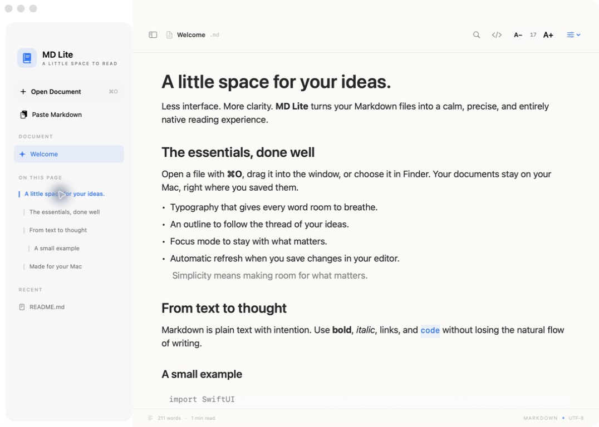
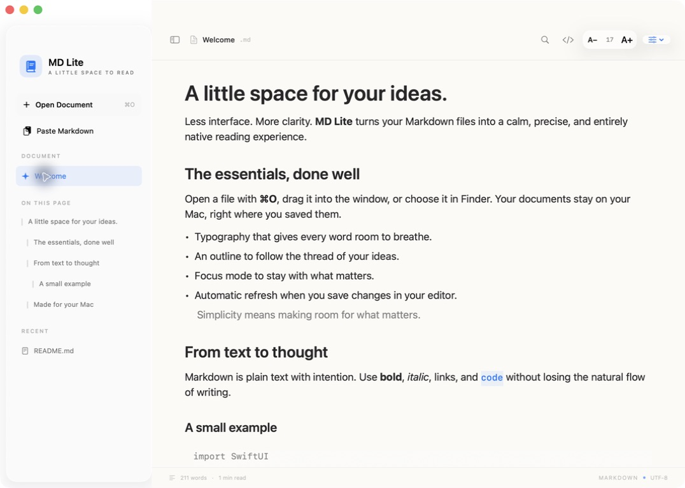
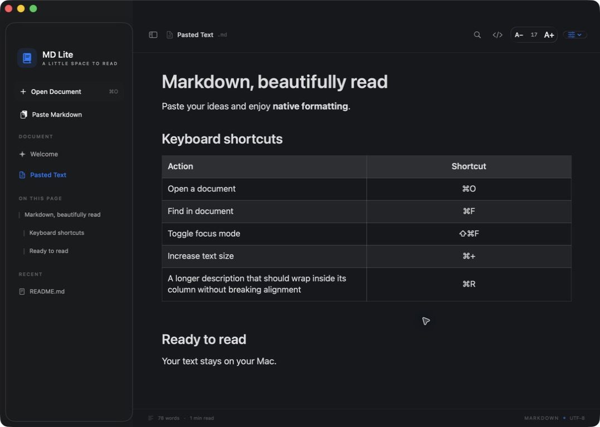

# MD Lite


**A little space to read — and write.**

A lightweight, native Markdown reader and editor for macOS. Built with SwiftUI, AppKit, TextKit, and Swift Markdown. The whole app is under 4 MB.

[](https://github.com/glozahn/md-lite/releases/latest) [](https://github.com/glozahn/md-lite/actions/workflows/swift.yml) [](LICENSE) 

[Download MD Lite](https://github.com/glozahn/md-lite/releases/latest) · [Build from source](#build-from-source) · [Shortcuts](#shortcuts) · [Contribute](#contributing)

## Three ways to look at a document

| Mode | Shortcut | What it is |
| --- | :---: | --- |
| **Reading** | ⌘1 | The finished document: typography, tables, images, diagrams. |
| **Editor** | ⌘2 | Write with the formatting in view. Markers such as `**` or `#` only appear on the line you are editing. |
| **Source** | ⌘3 | Plain Markdown with syntax colors. |

Press **⌘E** to jump between reading and editing. Undo and redo (**⌘Z**, **⇧⌘Z**) work across every edit, including checking a task in the reading view. Files you open save themselves as you type; new notes ask where to go the first time you press **⌘S**.

## GitHub Flavored Markdown

MD Lite follows the [GFM specification](https://github.github.com/gfm/) and renders what GitHub renders:

- Headings (ATX and Setext) with GitHub-style anchors, paragraphs, line breaks, and thematic breaks
- Emphasis, strong, strikethrough, inline code, and backslash escapes
- Inline, reference, and autolinks, including extended autolinks (`www.`, `https://`, e-mail)
- Ordered, nested, and task lists — click a checkbox to check it
- Tables with column alignment, rendered as native TextKit tables
- Fenced and indented code blocks with syntax highlighting and a copy button
- Block quotes and GitHub alerts (`> [!NOTE]`, `[!TIP]`, `[!IMPORTANT]`, `[!WARNING]`, `[!CAUTION]`)
- Raw HTML as it appears in real READMEs: `<p align="center">`, ``, `<picture>`, `<details>`, `<kbd>`, `<sub>`, `<sup>`, HTML tables, and comments. Script-like tags are filtered as GFM requires.
- [Mermaid](https://github.com/mermaid-js/mermaid) diagrams in ` ```mermaid ` blocks, drawn offline
- YAML front matter

## A calm navigator

The sidebar outlines the document as a collapsible tree, follows you while you scroll, filters long outlines, and jumps with **⌥⌘↑** / **⌥⌘↓**. Hide it with **⌃⌘S** (or **⌘\\**), or press **⇧⌘F** for focus mode. Choose a narrow, normal, wide, or full text column in Reading Preferences.

## Screenshots







## Download

Requires **macOS 14 Sonoma or later** and **Apple silicon**.

1. Download the latest [DMG from GitHub Releases](https://github.com/glozahn/md-lite/releases/latest).
2. Drag **MD Lite** into **Applications**.
3. Open a `.md` file from Finder or press **⌘O** inside the app.

### Windows and Linux

Each release also ships **MD Lite for Windows** (`MD-Lite-…-windows-x64-setup.exe`, installs for the current user, no admin rights) and **MD Lite for Linux** (`.AppImage` and `.deb`). It is a separate, lightweight [Tauri](https://tauri.app) app in [`desktop/`](desktop) that uses the system WebView: the same GitHub Flavored Markdown, HTML, alerts, code highlighting, and Mermaid rendering; Reading, Editor, and Source modes with undo; autosave; the outline navigator; and `Ctrl` versions of the shortcuts. The Windows installer is not code-signed yet, so SmartScreen may ask you to confirm the first launch.

To make MD Lite open Markdown files on double-click, choose **MD Lite ▸ Use MD Lite for .md Files…** — a short guide walks you through it. **Check for Updates…** in the same menu compares your version with the latest GitHub release.

## Shortcuts

Press **⌘/** inside the app to see them all.

| Action | Shortcut |
| --- | --- |
| Reading / Editor / Source | ⌘1 · ⌘2 · ⌘3 |
| Toggle reading and editing | ⌘E |
| Show or hide the sidebar | ⌃⌘S · ⌘\ |
| Focus mode | ⇧⌘F |
| New note · Open · Save · Save As | ⌘N · ⌘O · ⌘S · ⇧⌘S |
| Undo · Redo | ⌘Z · ⇧⌘Z |
| Find · Find next · Find previous | ⌘F · ⌘G · ⇧⌘G |
| Bold · Italic · Strikethrough · Inline code · Link | ⌘B · ⌘I · ⇧⌘X · ⇧⌘K · ⌘K |
| Heading 1–3 · Body text | ⌥⌘1–3 · ⌥⌘0 |
| List · Numbered list · Task list · Quote | ⇧⌘7 · ⇧⌘9 · ⇧⌘L · ⌘' |
| Code block · Table · Divider | ⇧⌘M · ⌥⌘T · ⌥⌘− |
| Continue a list · Indent · Outdent | ↩ · ⇥ · ⇧⇥ |
| Previous / next heading | ⌥⌘↑ · ⌥⌘↓ |
| Increase / reset / decrease text | ⌘+ · ⌘0 · ⌘− |
| Paste and read clipboard Markdown | ⇧⌘V |
| Reload from disk | ⌘R |
| Keyboard shortcuts | ⌘/ |

## Build from source

Use Xcode 26 or later. The package targets macOS 14 and uses Swift 5.9 or later.

```sh
git clone https://github.com/glozahn/md-lite.git
cd md-lite
swift test
./scripts/build-app.sh
open "dist/MD Lite.app"
```

The Windows and Linux app builds with Node 22 and Rust:

```sh
cd desktop
npm install
npm run tauri build
```

GitHub Actions builds both platforms and attaches the installers to each release (`.github/workflows/desktop.yml`).

Create a DMG with `./scripts/build-dmg.sh`. `scripts/notarize-app.sh` signs with a Developer ID, notarizes, and staples the app; it reads your identity and App Store Connect key from environment variables or from a local, git-ignored `scripts/notarize.env` (see `scripts/notarize.env.example`). Certificates and private keys are never stored in the repository.

## Privacy and weight

Documents stay on your Mac. Preferences and recent file paths are stored locally. MD Lite has no account, analytics, or telemetry.

- **Remote images** are blocked until you click **Show** (or enable *Always load remote images*).
- **Mermaid** runs offline in a hidden WebKit view with network access blocked. The library ships xz-compressed (about 750 KB) and is only loaded when a document contains a diagram.
- **Update checks** make one request to the GitHub Releases API, only when you ask or when you enable automatic checks.

## Contributing

Issues and pull requests are welcome. For rendering issues, include a small Markdown example, your macOS version, and the expected result.

## Credits and license

Inspired by [Markdown Guide](https://www.markdownguide.org/basic-syntax/), [QuickMD](https://qmd.app/), and [Typora](https://typora.io/). MD Lite is an independent project and is not affiliated with them.

MD Lite is released under the [MIT License](LICENSE). Swift Markdown, cmark-gfm, and Mermaid retain their own licenses; their notices ship inside the application bundle.
