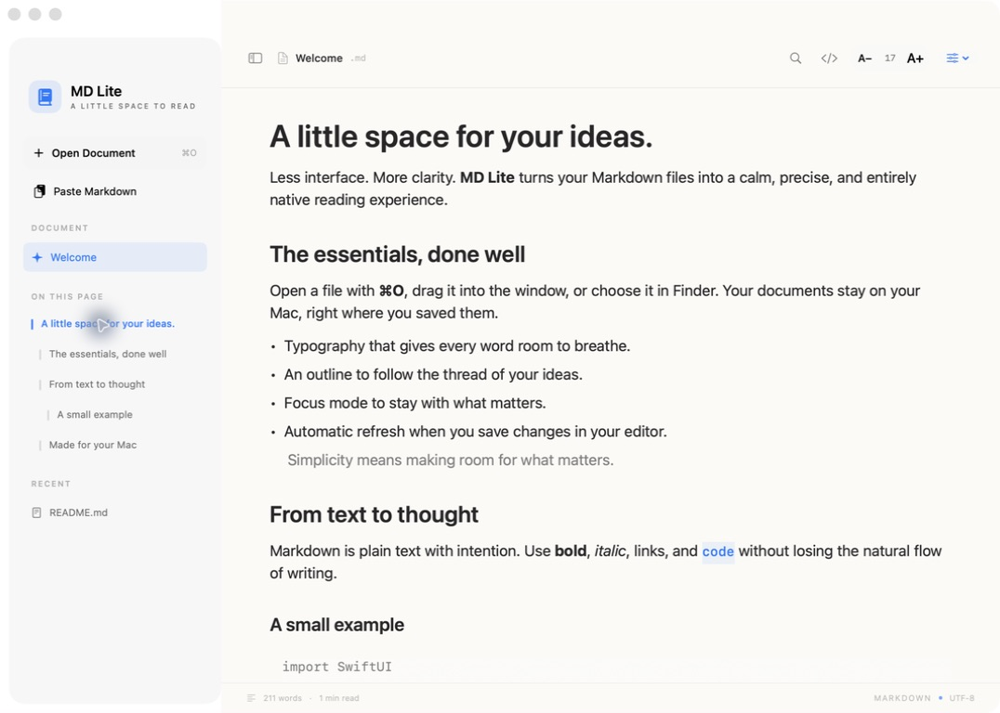
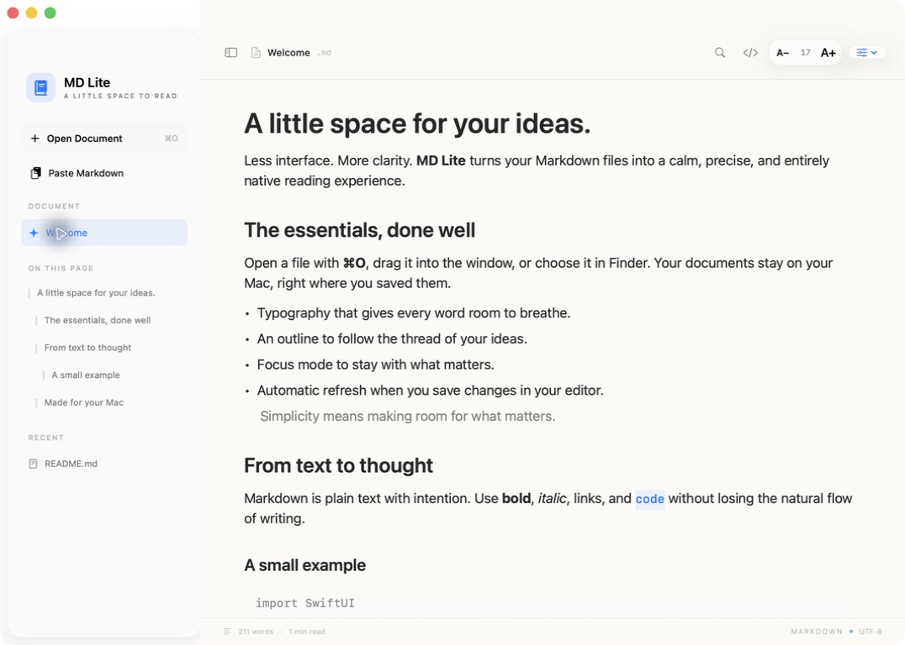
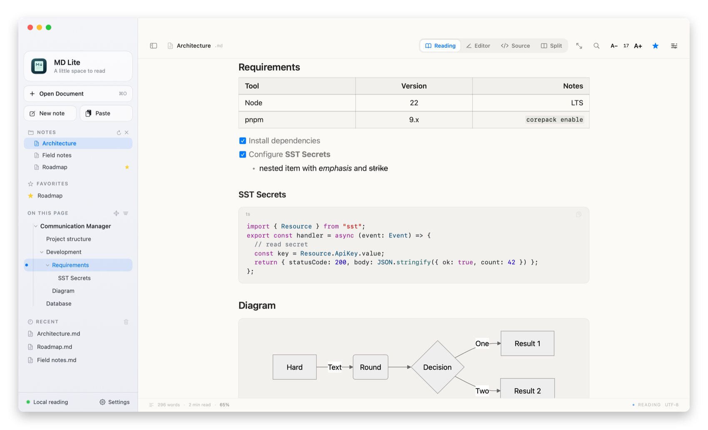
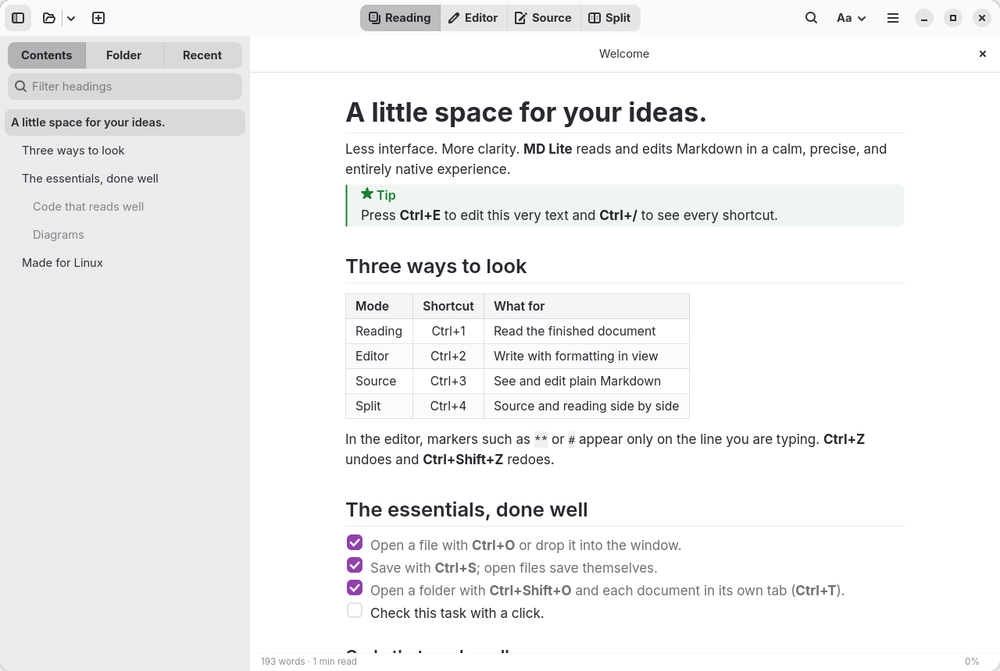
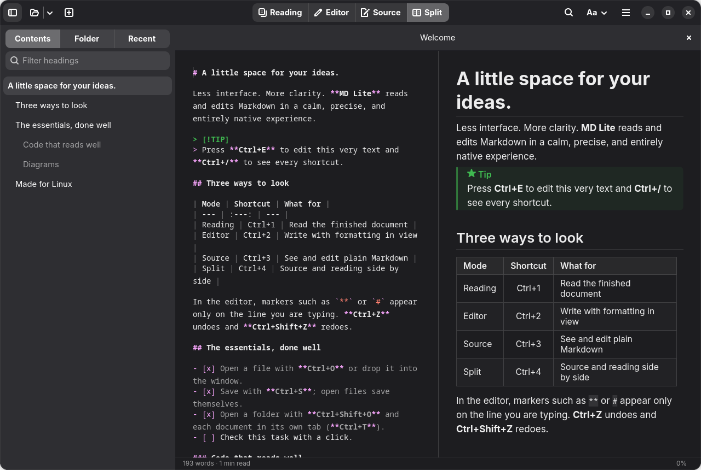

# MD Lite


**A little space to read, write, code.**

A lightweight, native Markdown reader and editor for macOS. Built with SwiftUI, AppKit, TextKit, and Swift Markdown. The whole app is under 4 MB. On Linux it is a native GTK 4 app written in Rust, about 2 MB to download.

[](https://github.com/glozahn/md-lite/releases/latest) [](https://github.com/glozahn/md-lite/actions/workflows/swift.yml) [](LICENSE) 

[Download MD Lite](https://github.com/glozahn/md-lite/releases/latest) · [Build from source](#build-from-source) · [Shortcuts](#shortcuts) · [Contribute](#contributing)

## Three ways to look at a document

| Mode | Shortcut | What it is |
| --- | :---: | --- |
| **Reading** | ⌘1 | The finished document: typography, tables, images, diagrams. |
| **Editor** | ⌘2 | Write with the formatting in view. Markers such as `**` or `#` only appear on the line you are editing. |
| **Source** | ⌘3 | Plain Markdown with syntax colors. |
| **Split** | ⌘4 | Source on the left, the finished page on the right, scrolling together. Drag the divider to resize. |

Press **⌘E** to jump between reading and editing. Undo and redo (**⌘Z**, **⇧⌘Z**) work across every edit, including checking a task in the reading view. Files you open save themselves as you type; new notes ask where to go the first time you press **⌘S**.

## GitHub Flavored Markdown

MD Lite follows the [GFM specification](https://github.github.com/gfm/) and renders what GitHub renders:

- Headings (ATX and Setext) with GitHub-style anchors, paragraphs, line breaks, and thematic breaks
- Emphasis, strong, strikethrough, inline code, and backslash escapes
- Inline, reference, and autolinks, including extended autolinks (`www.`, `https://`, e-mail)
- Ordered, nested, and task lists — click a checkbox to check it
- Tables with column alignment, rendered as native TextKit tables
- Fenced and indented code blocks with syntax highlighting and a copy button
- Block quotes and GitHub alerts (`> [!NOTE]`, `[!TIP]`, `[!IMPORTANT]`, `[!WARNING]`, `[!CAUTION]`)
- Raw HTML as it appears in real READMEs: `<p align="center">`, ``, `<picture>`, `<details>`, `<kbd>`, `<sub>`, `<sup>`, HTML tables, and comments. Script-like tags are filtered as GFM requires.
- [Mermaid](https://github.com/mermaid-js/mermaid) diagrams in ` ```mermaid ` blocks, drawn offline
- Math with `$…$`, `$$…$$` and ` ```math ` blocks, typeset offline with [MathJax](https://www.mathjax.org) only when a document contains it (`$5` stays a price)
- YAML front matter

## More than Markdown

MD Lite also opens the plain-text files that live next to your notes, each shown the way it reads best:

- **Code and scripts** — `.sql`, `.sh`, `.py`, `.js`, `.ts`, `.swift`, `.go`, `.rs`, `.css`, `.html`, `Dockerfile`, `Makefile`, `.diff` and more, with syntax highlighting.
- **Config and data** — `.json` (minified JSON is indented, keys stay in order), `.yaml`, `.toml`, `.ini`, `.env`, `.xml`, `.plist`.
- **Tables** — `.csv` and `.tsv` appear as a native table; edit the raw file in Source or side by side in Split.
- **Text** — `.txt` exactly as written, nothing interpreted as Markdown.
- **Logs** — `.log` files are read-only and follow new lines as they arrive, like `tail -f`; very large logs open at their last 2 MB.

Working folders list these files too, each with its own icon, and Finder offers MD Lite under *Open With* without taking over as their default app. To make MD Lite their app, use *Open with MD Lite* in Settings: it shows which app opens Markdown, text, logs, data and scripts today and switches any of them in one click.

## From the web, and to the terminal

- **Open Link** (**⌥⌘O**), pasting a link, or dragging one from your browser reads a document from the web: a README on GitHub, a gist, or any Markdown or text file. GitHub pages are swapped for their raw files, images and links keep working, and the sidebar shows the site instead of *Local reading*. Web documents are read-only; *Save a Copy* keeps one.
- **Feeds** — an RSS or Atom link opens as a document: each entry with its date, a plain-text summary and its link.
- **Open in Terminal** (**⌃⌘T**) opens the document's folder in your terminal (Terminal, iTerm, Warp, Ghostty…, chosen in Settings).
- **Run** (**⇧⌘R**) runs a `.sh` file, and shell code blocks get a ▶︎ next to *Copy*. MD Lite always asks first and shows the command; the output streams into a panel under the document. Nothing from the web can be run.

## Your folder is your brain

- **Quick Open** (**⌥⌘P**) jumps to any file in the working folder, your recent files or favorites by typing part of its name.
- **Search in Folder** (**⌥⇧⌘F**) finds text in every file of the working folder and opens the matching line.
- **Wiki links** — `[[Note]]` or `[[Note|shown text]]` opens another document by name, wherever it sits in the folder. A note that does not exist yet is offered to be created, and ⌘-click follows a link in the editor.
- **Mentioned in** — the sidebar lists the documents that link to the one in front, with the line that mentions it.
- **Version History** (*File ▸ Version History…*) keeps earlier saves of each file on this Mac, shows what changed, and restores any of them.
- **Pick up where you left off** — windows, tabs and panes come back when you reopen MD Lite, and every file opens where you stopped reading.
- **Paste** a web address over selected words to make a link; paste or drop an image and it is saved in an `assets` folder next to the document and linked.

## Present and preview

- **Present** (**⌥⌘↩**, or ▶︎ in the toolbar) shows a document as slides, one per `---` with a blank line before it, over the whole screen. Arrows, space and clicks move; Esc ends.
- **Quick Look** — press Space on a Markdown file in Finder to read it formatted, images included.

## Tabs, panes, and working folders

Each window has its own tab strip. **⌘T** opens a clean tab you can drop a file on, or open, create, or paste a document into; every tab keeps its own undo history and scroll position. Drag a tab or a file from Finder or the sidebar onto a document to see where it will land: the left or right half opens it in a side-by-side pane, the middle opens it as a tab there. **⇧⌘]** / **⇧⌘[** switch tabs, **⌃⌘←** / **⌃⌘→** move a tab between panes, and **⌥⌘W** closes a pane, moving its tabs to the other one.

Move a tab out with **⌃⌘N** (or *Move to New Window* in its menu) and it becomes its own window, keeping its undo history and reading position. *Keep on Top* in the Window menu leaves a window floating above your other apps while you read.

With many tabs open, the list button at the end of the tab strip (or **⇧⌘\\**) shows every tab in every window with its folder and path; type to filter and press Return to jump.

**⌘W** always closes the innermost thing first: a sheet or popover, then About or Settings, then the tab (and its pane when it was the last one); the app stays open. Open a whole folder with **⇧⌘O** (or drop it on the window) to browse its Markdown files as a tree in the sidebar; hidden and generated folders such as `node_modules` are skipped, and ⌘-click opens a file in a new tab. Settings open with **⌘,**.

Right-click a tab or any file in the sidebar to open it in a new tab or pane, save a copy, duplicate it, export it as HTML or PDF, print it, add it to Favorites, give it Finder tags and colors, reveal it in Finder, or copy its path. Hover a file to see its full path, or click the tab title for a breadcrumb.

## A calm navigator

The sidebar outlines the document as a collapsible tree, follows you while you scroll, filters long outlines, and jumps with **⌥⌘↑** / **⌥⌘↓**. Hide it with **⌃⌘S** (or **⌘\\**), or press **⇧⌘F** for focus mode, which hides everything but the text until you press it again (or Esc). Choose a narrow, normal, wide, or full text column in Reading Preferences.

## Updates

MD Lite keeps itself up to date. It checks GitHub Releases, downloads the disk image in the background, and only installs it after checking the download against its published SHA-256 and confirming that it is signed by the same developer and notarized by Apple. A discreet button in the footer restarts into the new version and reopens your documents; if you ignore it, the update lands when you quit. Turn it off in Settings, and read what changed at any time with *Help ▸ What's New*.

## Screenshots











## Download

Requires **macOS 14 Sonoma or later**, on Apple silicon or Intel.

1. Download the latest [DMG from GitHub Releases](https://github.com/glozahn/md-lite/releases/latest).
2. Drag **MD Lite** into **Applications**.
3. Open a `.md` file from Finder or press **⌘O** inside the app.

Or with [Homebrew](https://brew.sh):

```bash
brew tap glozahn/tap
brew trust glozahn/tap
brew install --cask md-lite
```

Homebrew asks you to trust a tap before it loads casks from it.

### Linux (GTK 4)

MD Lite for Linux is a native GTK 4 and libadwaita app in [`linux/`](linux), written in Rust. It is a port of the macOS app rather than a web view: the same renderer and editor ideas, drawn with GTK text views.

- Reading, Editor, Source, and Split modes; markers hide away from the line you are typing, and **Ctrl+Z** / **Ctrl+Shift+Z** undo across every edit, including checking a task in the reading view.
- GitHub Flavored Markdown with tables, task lists, alerts, raw HTML from real READMEs, syntax highlighting, and Mermaid diagrams drawn offline in a hidden WebKit view.
- Tabs you can drag between two panes or out into a new window, working folders, favorites and recent files, an outline that follows you, and focus mode.
- Files save themselves as you type and reload when another app changes them. Remote images stay blocked until you click **Show**.
- Export to HTML and PDF, print, Spanish and English, light and dark appearance, and the system accent color.

On Fedora, install the RPM from the [0.3.6 release](https://github.com/glozahn/md-lite/releases/tag/v0.3.6) (or build it yourself, see [Build from source](#build-from-source)):

```sh
sudo dnf install ./md-lite-0.3.6-1.fc44.x86_64.rpm
```

The shortcuts are the ones below with **Ctrl** in place of **⌘**; **F9** shows or hides the sidebar and **F11** enters focus mode.

### Windows and Linux (Tauri)

Each release also ships **MD Lite for Windows** (`MD-Lite-…-windows-x64-setup.exe`, installs for the current user, no admin rights) and **MD Lite for Linux** (`.AppImage` and `.deb`). It is a separate, lightweight [Tauri](https://tauri.app) app in [`desktop/`](desktop) that uses the system WebView: the same GitHub Flavored Markdown, HTML, alerts, code highlighting, and Mermaid rendering; Reading, Editor, Source, and Split modes with undo; tabs; working folders; autosave; the outline navigator; and `Ctrl` versions of the shortcuts. The Windows installer is not code-signed yet, so SmartScreen may ask you to confirm the first launch.

To make MD Lite open Markdown files on double-click, choose **MD Lite ▸ Use MD Lite for .md Files…** — a short guide walks you through it. **Check for Updates…** in the same menu compares your version with the latest GitHub release.

## Shortcuts

Press **⌘/** inside the app to see them all.

| Action | Shortcut |
| --- | --- |
| Reading / Editor / Source / Split | ⌘1 · ⌘2 · ⌘3 · ⌘4 |
| Toggle reading and editing | ⌘E |
| Show or hide the sidebar | ⌃⌘S · ⌘\ |
| Focus mode | ⇧⌘F |
| New tab · Close · Settings | ⌘T · ⌘W · ⌘, |
| Next / previous tab · Close pane | ⇧⌘] · ⇧⌘[ · ⌥⌘W |
| All tabs | ⇧⌘\\ |
| Move tab to the left / right pane | ⌃⌘← · ⌃⌘→ |
| New window · Move tab to new window | ⇧⌘N · ⌃⌘N |
| New note · Open · Open folder | ⌘N · ⌘O · ⇧⌘O |
| Save · Save As | ⌘S · ⇧⌘S |
| Undo · Redo | ⌘Z · ⇧⌘Z |
| Find · Find next · Find previous | ⌘F · ⌘G · ⇧⌘G |
| Bold · Italic · Strikethrough · Inline code · Link | ⌘B · ⌘I · ⇧⌘X · ⇧⌘K · ⌘K |
| Heading 1–3 · Body text | ⌥⌘1–3 · ⌥⌘0 |
| List · Numbered list · Task list · Quote | ⇧⌘7 · ⇧⌘9 · ⇧⌘L · ⌘' |
| Code block · Table · Divider | ⇧⌘M · ⌥⌘T · ⌥⌘− |
| Continue a list · Indent · Outdent | ↩ · ⇥ · ⇧⇥ |
| Previous / next heading | ⌥⌘↑ · ⌥⌘↓ |
| Increase / reset / decrease text | ⌘+ · ⌘0 · ⌘− |
| Paste and read clipboard Markdown | ⇧⌘V |
| Reload from disk · Print | ⌘R · ⌘P |
| Open Link · Open in Terminal · Run | ⌥⌘O · ⌃⌘T · ⇧⌘R |
| Quick Open · Search in Folder | ⌥⌘P · ⌥⇧⌘F |
| Present | ⌥⌘↩ |
| Keyboard shortcuts | ⌘/ |

## Build from source

Use Xcode 26 or later. The package targets macOS 14 and uses Swift 5.9 or later.

```sh
git clone https://github.com/glozahn/md-lite.git
cd md-lite
swift test
./scripts/build-app.sh
open "dist/MD Lite.app"
```

The Windows and Linux app builds with Node 22 and Rust:

```sh
cd desktop
npm install
npm run tauri build
```

GitHub Actions builds both platforms and attaches the installers to each release (`.github/workflows/desktop.yml`).

The native Linux app builds with Rust 1.82 or later against GTK 4.14, libadwaita 1.6, WebKitGTK 6.0, and libsoup 3. On Fedora:

```sh
sudo dnf install gtk4-devel libadwaita-devel webkitgtk6.0-devel libsoup3-devel rpm-build
cd linux
cargo test
make                 # target/release/md-lite
sudo make install    # or: make rpm, which writes the package to linux/dist/
```

Create a DMG with `./scripts/build-dmg.sh`. `scripts/notarize-app.sh` signs with a Developer ID, notarizes, and staples the app; it reads your identity and App Store Connect key from environment variables or from a local, git-ignored `scripts/notarize.env` (see `scripts/notarize.env.example`). Certificates and private keys are never stored in the repository.

## Privacy and weight

Documents stay on your Mac. Preferences and recent file paths are stored locally. MD Lite has no account, analytics, or telemetry.

- **Remote images** are blocked until you click **Show** (or enable *Always load remote images*).
- **Mermaid** runs offline in a hidden WebKit view with network access blocked. The library ships xz-compressed (about 750 KB) and is only loaded when a document contains a diagram.
- **MathJax** works the same way for formulas: xz-compressed (about 540 KB), offline, and only loaded when a document contains math.
- **Update checks** make one request to the GitHub Releases API, only when you ask or when you enable automatic checks.

## Contributing

Issues and pull requests are welcome. For rendering issues, include a small Markdown example, your macOS version, and the expected result.

## Credits and license

Inspired by [Markdown Guide](https://www.markdownguide.org/basic-syntax/), [QuickMD](https://qmd.app/), and [Typora](https://typora.io/). MD Lite is an independent project and is not affiliated with them.

MD Lite is released under the [MIT License](LICENSE). Swift Markdown, cmark-gfm, and Mermaid retain their own licenses; their notices ship inside the application bundle.
