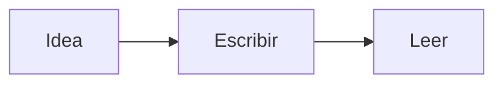

# Un espacio para tus ideas.

Menos interfaz. Más claridad. **MD Lite** lee y edita Markdown en una experiencia tranquila, precisa y completamente nativa.

> [!TIP]
> Pulsa **Ctrl+E** para editar este mismo texto y **Ctrl+/** para ver todos los atajos.

## Tres formas de ver

| Modo | Atajo | Para qué |
| --- | :---: | --- |
| Lectura | Ctrl+1 | Leer el documento terminado |
| Editor | Ctrl+2 | Escribir con el formato a la vista |
| Código | Ctrl+3 | Ver y editar el Markdown puro |
| Dividida | Ctrl+4 | Código y lectura lado a lado |

En el editor, las marcas como `**` o `#` aparecen solo en la línea donde escribes. **Ctrl+Z** deshace y **Ctrl+Shift+Z** rehace.

## Lo esencial, bien hecho

- [x] Abre un archivo con **Ctrl+O** o arrástralo a la ventana.
- [x] Guarda con **Ctrl+S**; los archivos abiertos se guardan solos.
- [x] Abre una carpeta con **Ctrl+Shift+O** y cada documento en su pestaña (**Ctrl+T**).
- [ ] Marca esta tarea con un clic.

### Código que se lee bien

```rust
fn main() {
    let idea = "Menos, pero mejor.";
    println!("{idea}");
}
```

### Diagramas



## Hecho para Linux

GTK 4 en la superficie. Rust en cada línea. Sin cuentas, sin servicios y sin distracciones. Consulta la [guía de Markdown](https://www.markdownguide.org/basic-syntax/) o la especificación [GFM](https://github.github.com/gfm/).

---

**Abierto por naturaleza.** Código abierto bajo licencia MIT.
